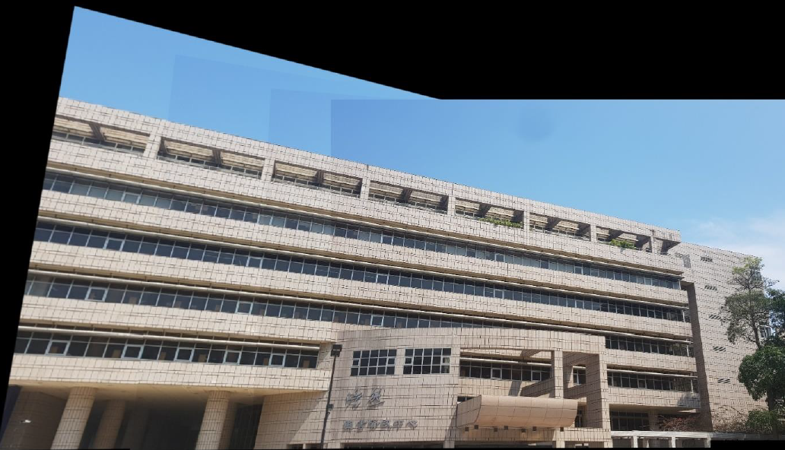

## Description

1. Detecting key point(feature) on the images: SIFT
2. Finding features correspondences (feature matching): KNN
3. Computing homography matrix: RANSAC
4. Stitching image (warp images into same coordinate system): Homography

## Visualization

